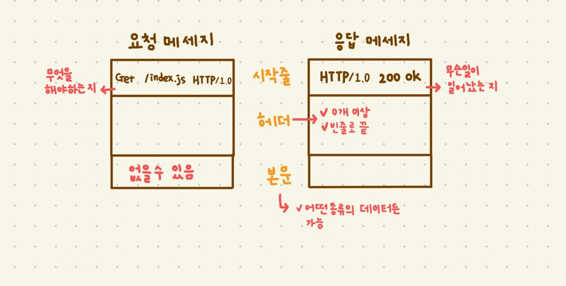

### HTTP 메시지

---



✔ `시작줄`과 `헤더`는 줄 단위로 분리된 ascii 문자열

✔ `시작줄`과 `헤더`는 줄바꿈 문자열로 `CRLF`를 쓴다.
 (**견고한 어플리케이션이라면 그냥 개행 문자도 받아들일 수 있게 해야 함**)
 
#### 메시지 문법

- 요청 메시지
```
<메서드> <요청 URL> <버전>
<헤더>

<엔티티 본문>
```

- 응답 메시지
```
<버전> <상태코드> <사유 구절>
<헤더>

<엔티티 본문>
```

모든 HTTP 메시지는 요청 (웹서버에 어떤 동작을 요구) / 응답 메시지(요청의 결과를 클라이언트에게 돌려줌)로 분류된다.

#### 헤더
`헤더`의 끝은 항상 빈 줄 이다.
    
##### ✔ 버전

```
HTTP/x.y
```
- 각각의 응답 / 요청 메시지의 `버전`을 알려주는 역할
 (응답/요청 메시지의 버전은 다를 수 있음)
- 어떤 어플리케이션이 지원하는 가장 높은 HTTP 버전 의미
- 
    
##### ✔ 상태 코드

200번 대 : 성공

300번 대 : 리소스가 옮겨졌음을 의미
 
400번 대 : 잘못된 요청

500번 대 : 서버 실패


📢 참고: HTTP 완벽 가이드