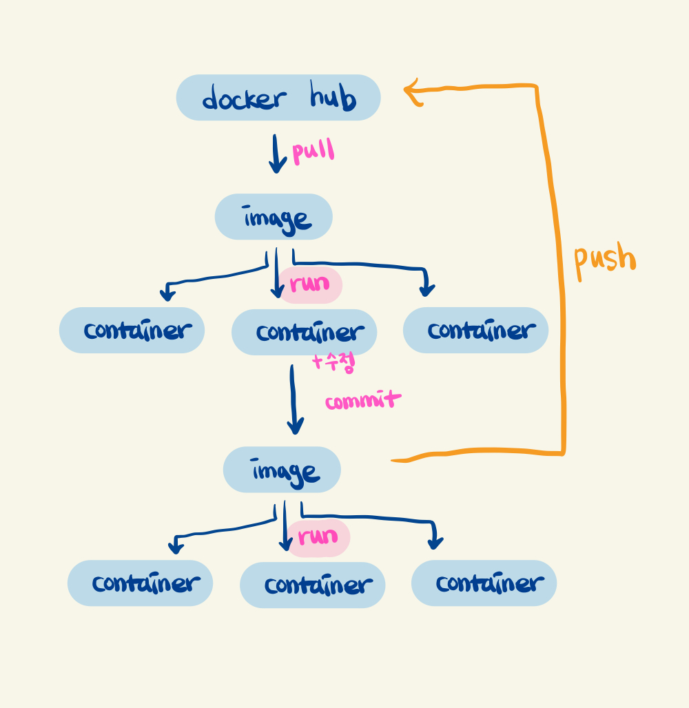

## 도커 필수 개념

도커는 **컨테이너 기반의 오픈소스 가상화 플랫폼**이다.

### 호스트란 ?
컨테이너가 설치되는 운영체제

### 컨테이너란 ?
실행의 독립성을 확보해주기 위해, 운영체제 수준의 격리

**어플리케이션을 실제 구동 환경으로 부터 추상화하고, 프로그램의 배포 및 관리를 단순하게 해주는 기술**

하나의 도커 호스트에 **여러개의 컨테이너**를 띄울 수 있다.

### 컨테이너를 사용함으로써 얻는 장점
- 일관성있는 런타임 환경
- 디스크 용량 절감
- 낮은 오버헤드

### 이미지란 ?
**컨테이너 실행에 필요한 파일, 설정 값등을 포함하고 있는 것 (immutable)**

> 같은 이미지에서 여러개의 컨테이너를 생성할 수 있다.

**도커 허브**(도커 레지스트리)에서 **이미지**를 내려받아(`pull`) **컨테이너**를 실행시킨다.(`run`)
= app store 에서 프로그램을 다운받아 process를 실행시키는 것

### 볼륨
도커의 컨테이너 안에 있는 파일을 수정하고 싶을 때 주의해야 한다.
- 컨테이너 내부에서 파일을 직접 수정할 수 있다. (실행 중인 컨테이너 내부에서 command 수행 `docker container exec`)
- 단, 컨테이너가 사라진다면 수정한 파일 내용도 함께 사라진다.

영구적으로 저장할 수 있는 환경과 컨테이너를 연결해준다면 (`volume`, `-v` 옵션) 컨테이너가 사라져도, 수정한 파일 내용은 사라지지 않는다.

### 도커 명령어
1. 도커 이미지 내려받기
```
$ docker pull
```

2. 컨테이너 실행
```
$ docker run [OPTIONS] IMAGE[:TAG|@DIGEST] [COMMAND] [ARG...]

// ex
$ docker run --name wc1 httpd
```

대표적인 옵션 : `--name {names 값 (식별값)}`

3. 컨테이너 조회
```
$ docker ps [-a]
```

종료된 컨테이너도 조회 : `-a` 옵션 붙일 시

4. 컨테이너 실행
```
$ docker start [OPTIONS] CONTAINER [CONTAINER...]
```

5. 컨테이너 실행 중지
```
$ docker stop [OPTIONS] CONTAINER [CONTAINER...]
```

stop 한다고 삭제되는 것이아니라 실행을 중단시키는 것

6. 컨테이너 삭제
```
$ docker rm [OPTIONS] CONTAINER [CONTAINER...]
```

7. 이미지 조회
```
$ docker images
```

8. 이미지 삭제
```
$ docker rmi {이미지 names}
```

### 도커의 port forwarding
도커는 호스트 내부에 여러개의 컨테이너를 띄울 수 있다.
(host 와 컨테이너의 포트는 별개이다.)

즉, host 의 포트와 컨테이너의 port 를 아래와 같은 명령어로 포워딩해줄 수 있다.
```
$ docker run -p 80:80 httpd

// 80:80 = host의 포트번호:컨테이너의 포트번호
```

### 이미지 커스터마이징 (`commit`)
컨테이너에 변경이 일어났을 때 변경사항과 함께 새로운 image 로 저장하여 재사용 할 수 있다.


**example ..**
1. ubuntu image 실행 및 내부 컨테이너 내용 변경 (git 설치)
    ```
    $ docker run -it --name my-ubuntu ubuntu bash
    # apt update && apt install git // git 설치
    ```

2. `commit` 하여 신규 이미지로 저장
    ```
    // my-ubuntu 이미지를 dahye repository 의 ubuntu-git 이라는 이미지 생성
    $ docker commit my-ubuntu dahye:ubuntu-git
    ```

3. docker images 결과
    ```
    $ docker images
    REPOSITORY   TAG              IMAGE ID       CREATED          SIZE
    dahye        my-ubuntu-git2   f5fd7d3ce2e9   17 minutes ago   206MB
    ```

### 컨테이너 명령어 수행
실행중인 컨테이너 내부에서 command 를 수행할 수 있다.

```
$ docker container exec [OPTIONS] CONTAINER COMMAND [ARG...]
```

**example ..**
1. 대상 컨테이너를 지정하여 쉘 명령어 실행
   ```
   // wc1 (container names), ls 쉘 명령어
   $ docker container exec wc1 ls
   ```
2. 이미 실행중인 컨테이너의 쉘 실행
   ```
   // /bin/bash 를 지원하지 않는 컨테이너는 /bin/sh 실행
   $ docker container exec -it {컨테이너 names} /bin/bash
   ```

명령어를 지속가능한 환경에서 수행하기 위해서는 `-it` 옵션


## 참고

[https://cultivo-hy.github.io/docker/image/usage/2019/03/14/Docker%EC%A0%95%EB%A6%AC/](https://cultivo-hy.github.io/docker/image/usage/2019/03/14/Docker%EC%A0%95%EB%A6%AC/)
[https://docs.docker.com/engine/reference/run/](https://docs.docker.com/engine/reference/run/)
[https://www.44bits.io/ko/post/building-docker-image-basic-commit-diff-and-dockerfile#%EB%93%A4%EC%96%B4%EA%B0%80%EB%A9%B0](https://www.44bits.io/ko/post/building-docker-image-basic-commit-diff-and-dockerfile#%EB%93%A4%EC%96%B4%EA%B0%80%EB%A9%B0)