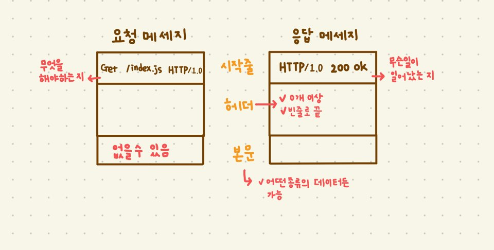

### HTTP 메시지

---



✔ `시작줄`과 `헤더`는 줄 단위로 분리된 ascii 문자열

✔ `시작줄`과 `헤더`는 줄바꿈 문자열로 `CRLF`를 쓴다.
 (**견고한 어플리케이션이라면 그냥 개행 문자도 받아들일 수 있게 해야 함**)
 
#### 메시지 문법

- 요청 메시지
```
<메서드> <요청 URL> <버전>
<헤더>

<엔티티 본문>
```

- 응답 메시지
```
<버전> <상태코드> <사유 구절>
<헤더>

<엔티티 본문>
```

모든 HTTP 메시지는 요청 (웹서버에 어떤 동작을 요구) / 응답 메시지(요청의 결과를 클라이언트에게 돌려줌)로 분류된다.

#### 시작줄


##### ✔ 버전

```
HTTP/x.y
```
- 각각의 응답 / 요청 메시지의 `버전`을 알려주는 역할
 (응답/요청 메시지의 버전은 다를 수 있음)
- 어떤 어플리케이션이 지원하는 가장 높은 HTTP 버전 의미
- 
    
##### ✔ 상태 코드

200번 대 : 성공

300번 대 : 리소스가 옮겨졌음을 의미
 
400번 대 : 잘못된 요청

500번 대 : 서버 실패

#### 헤더
헤더와 메서드는 클라이언트와 서버가 무엇을 하는지 결정하기 위해 함께 사용된다.

- `헤더`의 끝은 항상 빈 줄 이다.
- 이름, 쉼표, 공백(없어도 된다.), 필드값, `CRLF`가 순서대로 온다.
- `헤더`는 여러 줄로 나눌 수 있다.
```
Server: Test Server
    Version 1.0
```
위의 코드는 `Server: TestServer Version 1.0`과 같다.

##### ✔ 헤더의 분류
- 일반 헤더(General Headers)
- 요청 헤더(Request Headers)
    - 요청 시 포함되는 헤더이다.
    - Accept 관련 헤더
        - 서버에게 자신의 선호와 능력을 알려줄 수 있다.
        - 서버는 이것을 참고하여 더 똑똑하게 전달할 수 있다. (즉, 서버가 클라이언트에서 사용할 수도 없는 것을 전송하는 데 시간과 대역폭을 낭비하지 않아도 된다는 의미이다.)
- 응답 헤더(Response Headers)
    - 응답 시 포함되는 헤더이다.
- 엔티티 헤더(Entity Headers)
    - 본문에 대한 헤더를 말한다.
    - 본문의 데이터 타입을 정의한다.
- 확장 헤더(Extension Headers)

##### ✔ Content-Type

기본 문법
```
Content-Type: media-type
Content-Type: text/html; charset=utf-8
```

📢 참고: HTTP 완벽 가이드