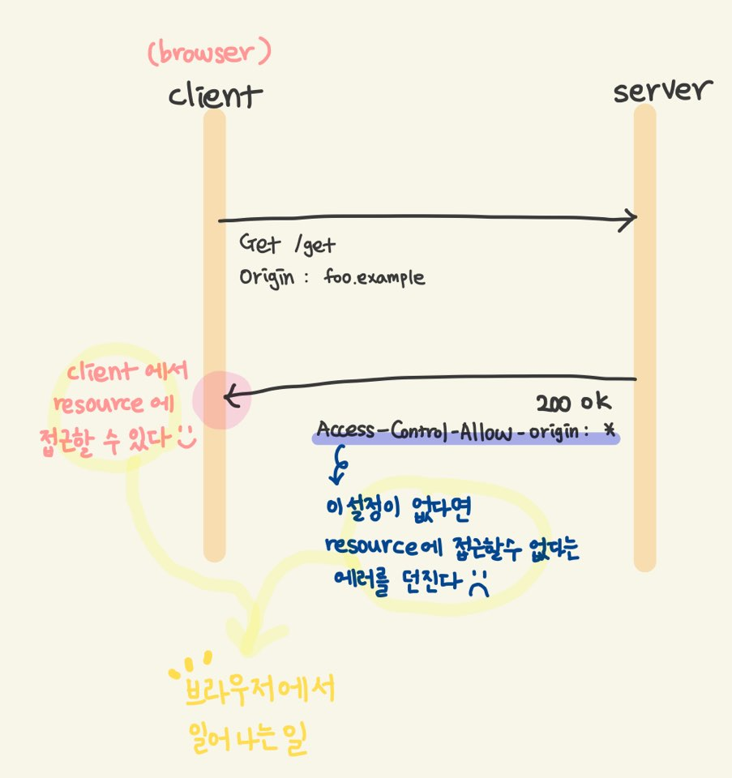
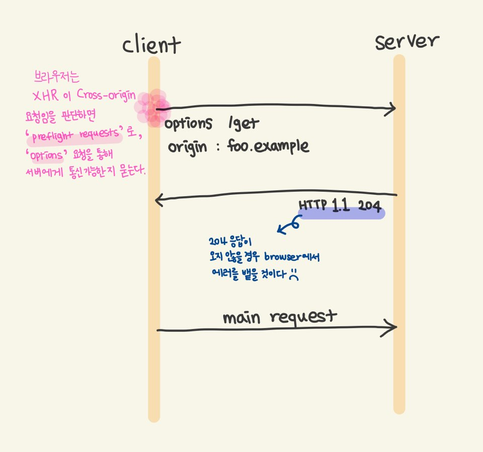

### CORS (Cross-Origin Resource Sharing)

> 💡 `CORS`는 보안에 반하는 정책이다.
> 보안을 위해 내놓은 정책(cross-origin 을 허용하지 않는 것)을 무시하기 위한 매커니즘이다.

- `CORS` 는 W3C 에서 내놓은 정책이다.
- **브라우저**가 **한 출처(origin)**에서 **다른 출처(cross-origin)**의 리소스를 엑세스하도록 지시하는 메커니즘이다.
    - 기본적으로 같은 origin은 허용한다.

#### `same-origin`과 `cross-origin`
먼저 `origin`이란 특정 사이트의 `URL`이다.

**Scheme(프로토콜), host(도메인), port(포트)** 기준으로 `same-orgin`과 `cross-origin`을 구분할 수 있다.
모두 같으면 `same-origin`, 하나라도 다르면 `cross-origin`이다.

#### `CORS`를 사용하는 요청
아래와 같은 케이스가 있다고만 알아두자.

1. XmlHttpRequest와 Fetch Apis 호출하는 경우
    - **XmlHttpRequest(XHR)은 AJAX 에서 사용된다.**
2. CSS 내에서 @font-face 속성에서 Cross-Origin의 폰트 리소스를 호출하는 경우
3. WebGL에서 texture를 사용하는 경우
4. CanvasRenderingContext2D의 drawImage() 메소드를 사용하여 Image/video 프레임을 그리는 경우
5. CSS Shapes from images

자세히 알고싶다면, [참고 사이트](https://developer.mozilla.org/en-US/docs/Web/HTTP/CORS)를 확인하자. 

#### `CORS` 동작 방식
> `CORS` 동작 방식은 `Simple Request`와 `Preflight Requests` 로 나누어진다.

**🤔 어떤 기준으로 방식이 나누어질까?**
아래의 세가지 기준을 모두 만족하는 경우 `Simple Requests` 방식으로 동작한다.

- HTTP Method가 `GET`, `POST`, `HEAD` 이셋 중에 하나로 요청한 경우
- Fetch 표준 정책에서 정의한 Forbidden Header Name 이라는 헤더 목록(client에서 자동으로 넣음)과
  CORS-safelisted request header 라는 헤더 목록(client에서 수동으로 넣을 수 있음) **이외에** 
  다른 커스텀 헤더, 권한과 관련된 헤더가 **없는** 경우
- HTTP Method가 `POST`인 경우 `Content-Type` 헤더가
  `application/x-www-form-urlencoded`, `multipart/form-data`, `text/plain` 이 세 가지 값에 포함되는 경우

이 조건을 모두 만족하지 않는다면, `Preflight Requests` 방식으로 동작한다.

**✔ Simple Requests**

**✔ Preflight Requests**

**위의 그림은 아주 간단히 그린 것! 아래의 참고 사이트에 아주 친~절히 설명되어있다 😊👏**

#### 참고
- [왜 모르는가? - CORS 정책](https://vvshinevv.tistory.com/60?category=861457)
- [왜 모르는가? - CORS 이슈 해결](https://vvshinevv.tistory.com/61?category=861457)
- [모질라 - CORS](https://developer.mozilla.org/en-US/docs/Web/HTTP/CORS)

