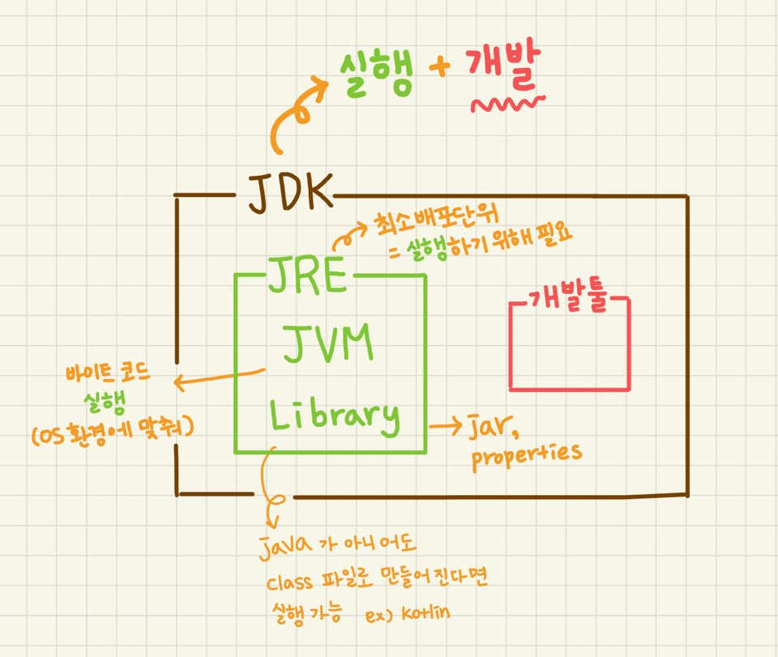
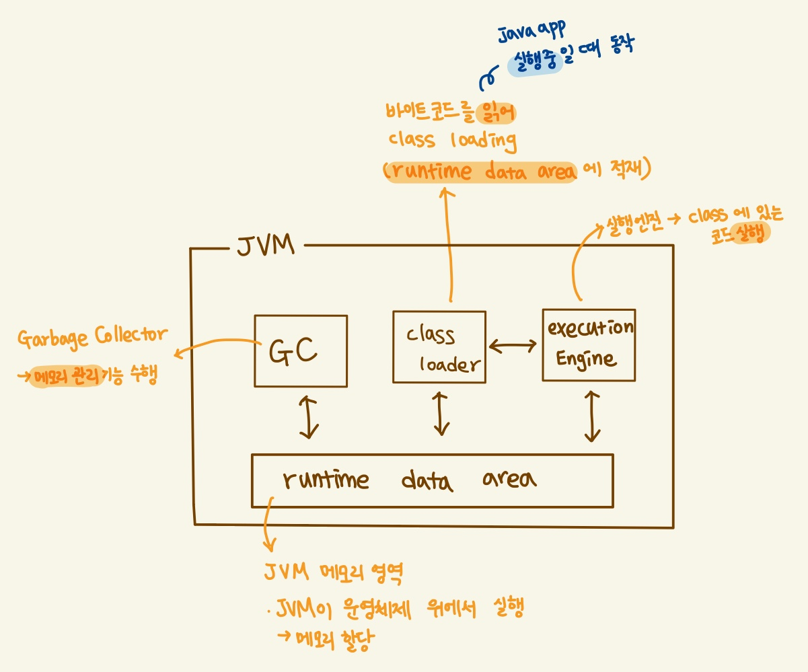

### JVM, JRE, JDK

---

- 참고로 `java 11` 에서 부터는 `JDK`만 제공한다. (`JRE`를 따로 제공하지 않음)

### JVM 구조
- java source (.java 파일)은 **java compiler**에 의해 java byte code(.class 파일) 이 생성된다.
- 이 과정을 통해 생성된 바이트 코드와 class library 를 기반으로 **class loader** 가 클래스 로드한다.

### 참고
- [https://hoonmaro.tistory.com/19](https://hoonmaro.tistory.com/19)