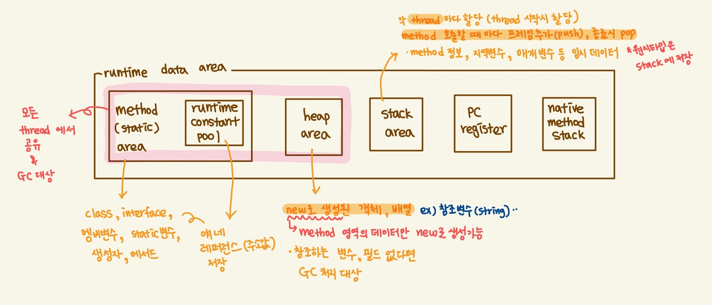
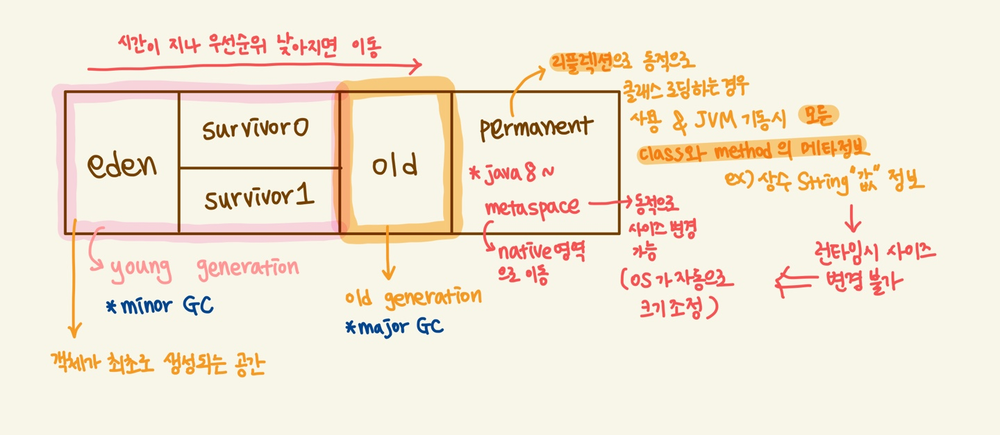

# JVM, JRE, JDK

---

- 참고로 `java 11` 에서 부터는 `JDK`만 제공한다. (`JRE`를 따로 제공하지 않음)

## JVM 구조
- java source (.java 파일)은 **java compiler**에 의해 java byte code(.class 파일) 이 생성된다.
- 이 과정을 통해 생성된 바이트 코드와 class library 를 기반으로 **class loader** 가 클래스 로드한다.

### runtime data area
JVM 메모리 영역 (JVM 이 운영체제 위에서 실행되는 시점에 메모리 영역 할당!)

- heap memory : 클래스 인스턴스, 배열 등, **공유 메모리**라고도 부른다. (여러 스레드에서 공유되는 데이터들 저장)
- 네이티브 메서드 스택 : 자바 코드가 아닌 다른 언어로 된(보통 C 코드) 코드들이 실행하게 될 때의 스택 정보 관리

### heap 영역과 garbage collector
garbage collector 는 동적으로 할당한 메모리 영역 중 사용하지 않는 영역을 탐지하고 해제하는 역할을 수행

#### garbage collector 과정
- stack 의 모든 변수를 스캔하면서 각각 어떤 객체를 참조하고 있는 지 찾아서 마킹
- reachable object 가 참조하고 있는 객체도 찾아서 마킹
- **사용하지 않는 객체 삭제**

> GC 를 개발자가 임의로 하지 말자. (특히 웹 기반의 시스템에서는) - jvm 의 역할이다.
> 
> 성능히 현저하게 안좋아질 수 있다.

**minor GC 발생**
- eden 영역이 꽉 차면, minor GC 발생
- eden 영역의 reachable 객체는 survivor 0 으로 옮겨진다.
  - 이 때, 객체의 크기가 아주 큰 경우엔 바로 **old** 영역으로 이동
- eden 영역의 unreachable 객체는 메모리에서 해제
- 반~복 (eden 이 차면 -> survivor 0 이 채워짐)
- survivor 0 이 다 차게됨
- survivor 0 영역의 객체가 survivor 1 로 이동 (이동한 객체는 age 증가)
- survivor 1 이 다 채워졌을 때, survivor 0 으로 이동시키며, 사용하지 않는 메모리 해제 (**바로 old 로 가는게 아님!**)
    - 이 때, 한 영역(survivor 0~1 중 한 영역)은 비워진 상태로 유지
    - survivor 1 <-> survivor 0 옮기면서 age 가 증가된다.
- age 가 특정 값 이상이 되면 **old generation** 으로 옮겨진다. (promotion 과정)
**major GC 발생**
- old generation 이 꽉 차면, **full GC (major GC)** 발생

### StackOverflowError
스택의 크기는 고정적이거나 가변적일 수 있다. 연산을 하다가 JVM의 스택 크기의 최대치를 넘어섰을 경우에는 `StackOverflowError`가 발생한다.

### OutOfMemory(OOM)
가변적으로 스택의 크기를 늘리려고 할 때 메모리가 부족하거나, 스레드를 생성할 때 메모리가 부족한 경우 발생한다.
- garbage collector 가 새로운 object 를 유지하기 위해 새로운 공간을 확보하지 못할 때 발생
  - heap size 부족한 경우
  - permanent area 가 가득 차면 outOfMemory 발생
  - memory leak 에 의해
`OutOfMemoryError`가 발생하면 JVM 이 다운된다.

#### 메모리 릭과 GC
> 메모리 릭과 GC를 연관지으려면 **full GC가 일어난 이후에 메모리 사용량**을 확인하는 것이다.
>
> 이 때, point 는 **full gc**의 동작 여부이다. full gc가 일어나지 않은 시스템에 메모리 릭이 있다고 얘기할 수 없다 !

**Full GC가 일어난 이후 Old 영역의 메모리 사용량을 확인하자**
- full gc 가 일어난 이후에도 메모리 사용량이 80% 이상이면 메모리 릭을 의심할 수 있다.

### GC 튜닝
> java 기반의 모든 서비스에서 GC 튜닝을 할 필요는 없음!
> 시스템 상황에 따라 최적의 GC 옵션을 찾아가야 함

#### GC 튜닝을 언제하는 게 좋을까 ?
- JVM 메모리 크기를 지정하지 않았고,
- timeout 이 지속적으로 발생하는 경우
  - timeout 이 발생하는 이유가 서버간의 통신 문제, 원격 서버의 성능 이슈로 발생할 수 있지만, GC 때문일 수 있다.
  
#### GC 튜닝의 목적을 두 가지로 나눌 수 있다.
- old 영역으로 넘어가는 객체의 수 최소화
  - old 영역으로 이동하는 객체의 수를 줄이면, full gc 가 발생하는 빈도를 줄일 수 있다.
- full gc 의 시간 최소화
  - full gc 의 실행에 오랜 시간이 소요되면, 타임아웃이 발생할 수 있다.
  
> full gc 실행 시간을 줄이기 위해 old 영역의 크기를 줄이면 `OutOfMemoryError`가 발생하거나 full GC 횟수가 늘어난다.
> 
> 반대로, old 영역의 크기를 늘리면 full GC 횟수는 줄어들지만 수행시간이 늘어난다.
> 
> **따라서, old 영역의 크기를 '잘' 설정해야 한다.**

> GC 를 튜닝할 때에는 여러 옵션을 여러 서버에 설정해보고, 모니터링 후 개선된 경우의 옵션을 적용하는 것이 바람직하다!

#### GC 튜닝의 절차
1. GC 상황 모니터링
    - `jsat` 명령어를 사용하여 GC 상황 확인
    - `-verbosegc` 옵션을 설정해 두고 로그를 남겨 분석하는 것이 가장 좋음
   
    GC 를 수행한 시간 분포와 얼마나 자주 GC 가 발생하는 지 파악
   
    minor GC, full GC 시간만 보지 말고, GC 가 수행되는 횟수도 확인하자.
   
    **GC 가 필요하지 않은 기준**
    - minor GC 시간이 빠르다 (50ms 내외)
    - minor GC 주기가 빈번하지 않다 (10초 내외)
    - full GC 처리 시간이 빠르다 (보통 1초 내외)
    - full GC 주기가 빈번하지 않다 (10분에 1회)
2. 모니터링 결과 분석 후 GC 튜닝 여부 결정
    - GC 수행 시간이 1-3 초, 10초가 넘는다면 GC 튜닝 필수
3. GC 방식/메모리 크기 지정
    - 여러 서버를 대상으로 옵션 별 성능 차이를 확인하는 것이 중요! (운영중인 시스템 특성에 따라 GC 방식이 다르므로 해당 시스템에 최적인 방식을 찾아야 함)
    - 메모리 크기
        - 메모리 크면,
            - GC 발생 횟수 감소
            - GC 수행 시간 증가
        - 메모리 크기가 작으면,
            - GC 발생 횟수 증가
            - GC 수행 시간 감소
        따라서, 정답은 없다! 측정 데이터 셋을 최대한 많이 만들어 모니터링을 통해 확인하여 선택하자.
4. 결과 분석
    - 최소 24시간 이상 데이터를 수집한 후에 분석을 하자. 메모리 할당에 대한 확인 필요
5. 결과가 만족스러울 경우 전체 서버에 반영 및 종료

#### 힙 덤프
메모리를 적게 잡는다면 `OutOfMemoryError`가 발생할 수 있는데, 이 때 원인 파악을 하기 위해 **힙 덤프를 뜬다.**

**힙 덤프**는 현재 java 메모리에 어떤 객체와 어떤 데이터가 있는지 확인하기 위한 메모리의 단면 파일이다.

주의! JDK 에 포함되어 있는 jmap 이라는 명령어로 생성할 수 있으나, 파일을 생성하는 도중 java 프로세스가 멈추기 때문에 시스템을 운영하고 있을 때는 생성하지 말 것

### permanent area
- 클래스의 메타 데이터 정보 저장
- `Class` 클래스를 통해 클래스를 동적으로 생성하는 경우 (`reflection` 사용하는 경우)

#### java8 에서 perm 이 사라지고 metaspace 가 추가된 이유 ?
perm 영역은 JVM heap 에서 관리되는 영역이었기 때문에 메모리의 한계가 존재 => 개발자의 실수로 OOM 이 발생할 수 있음

metaspace 로 변경되며 OS 레벨에서 관리되는 native 영역으로 이동 => 영역에 대한 사이즈가 perm 영역보다 훨씬 크다.

### 참고
- [https://hoonmaro.tistory.com/19](https://hoonmaro.tistory.com/19)
- [outOfMemoryError 관련 포스팅](https://www.nextree.co.kr/p3878/)
- [https://changrea.io/java/oom-issue/](https://changrea.io/java/oom-issue/) :: 읽어보기!