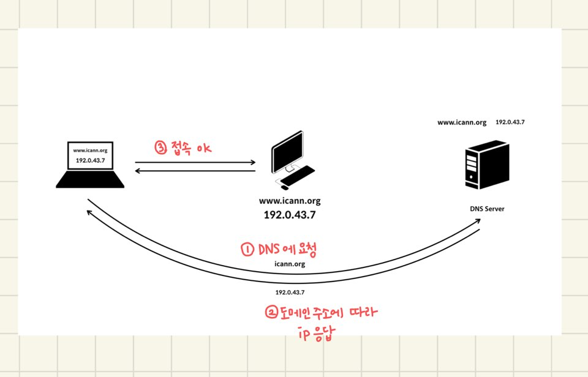

### 도메인 네임 시스템 서버 (DNS)

ip 주소는 `127.0.0.1` 과 같이 `숫자`와 `.`으로 이루어진 문자열이다.
이 주소는 기억하기가 쉽지않다. (하나도 외우기 어려운데, 두개, 세개는 더 어려울 것..😅)
그래서 등장한 것이 **도메인**이다.🤗

> **도메인**은 IP에 이름을 부여하는 것

#### DNS 동작 원리

> DNS를 통해 도메인에 해당하는 IP주소를 응답받는다.

#### DNS TMI
호스팅 사이트를 통해 도메인 주소를 등록 요청할 때, 1~2일의 시간이 소요된다고 나온다.
그 이유는 `캐싱`에 있다. DNS는 내부적으로 `캐싱`이된다.
따라서, 전세계적으로 적용되려면 시간이 소요된다.

> 전세계적으로 흩어져있는 네임서버들이 협력해서 도메인에 해당하는 IP주소를 알려준다.😎

참조 : [생활코딩](https://opentutorials.org/course/3276/20299)