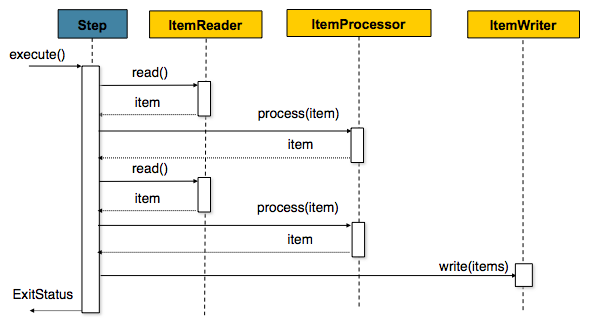

## 스프링 배치
> spring-batch 를 적용하면서 알게 된 내용을 정리해보자.

### 스프링 부트 배치를 사용하는 이유
- 대용량 데이터 처리에 최적화 되어있다.
- 로깅 처리, 통계 처리, 트랜잭션 관리 등 필수 기능을 지원한다.
- 예외 상황에 대해 방어 기능이 존재한다.
- 비즈니스 로직에만 집중하여 배치를 구성할 수 있도록 도움을 준다.

### 메타테이블

- `BATCH_JOB_INSTANCE` : job parameter 에 따라 job이 실행될 때 생성되는 테이블
- `BATCH_JOB_EXECUTION` : job instance 의 성공/실패 여부가 저장되는 테이블 (성공한 내역이 있다면, 더이상 job은 수행되지 않는다.)
- `BATCH_JOB_EXECUTION_PARAM` : `BATCH_JOB_EXECUTION` 테이블이 생성될 때 입력받은 job parameter 데이터가 저장되는 테이블

### 배치 Job 생성
- 배치 기능 활성화를 위해 `@EnableBatchProcessing` 어노테이션을 추가해야한다. (main Application class 에)
- `job` 은 하나 또는 여러 `step`을 가지고 있다.
- `step`은 `tasklet` 하나 또는 `reader`, `proccessor`, `writer` 한 묶음을 가진다.
    - `tasklet` 하나와 `reader`, `proccessor`, `writer` 한 묶음은 같은 레벨이다.
    - `reader` -> `proccessor` -> `writer` 의 흐름을 가진다.
        - `reader` : 데이터 저장소에서 특정 데이터를 읽는 역할
        - `proccessing` : `reader`에서 읽어 온 데이터를 가공/처리하는 역할 (필수는 아님)
        - `writer` : 수정된 데이터를 다시 저장소(데이터베이스)에 저장하는 역할
- `decide` 는 분기만 담당하는  타입
        
### job flow
> job 내부의 step들 간의 순서 혹은 처리 흐름을 제어할 때 사용한다.

1. `Next` : 순차적으로 `step`을 연결시킬 때 사용
2. `Flow` : `step` 의 성공/실패에 따라 다른 시나리오로 진행하고 싶은 경우 사용 

#### Batch Status vs Exit Status
- Batch status : job 또는 step의 실행 결과
- Exit status : step 의 실행 후 상태

Spring batch는 기본적으로 Exit status의 exitcode 는 Step의 Batch status 와 같도록 설정되어있다.

### spring batch scope & JobParameter
두 어노테이션은 bean 생성 시점을 singleton scope 가 아닌 scope가 실행되는 시점으로 생성을 지연시킨다.

- `@JobScope` : step 선언 문에서 사용
    - Job 실행 시점에 bean 이 생성된다.
- `@StepScope` : tasklet 이나 ItemReader, ItemWriter, ItemProcessor 에서 사용
    - step 실행 시점에 해당 컴포넌트를 spring bean 으로 생성한다.

**bean 의 생성 시점을 어플리케이션 실행 시점이 아닌, step 혹은 job의 실행 시점으로 지연시키면서 얻는 장점**
1. `JobParameter`의 late binding 가능
    - 어노테이션으로 jobParameter 를 받을 수 있다.
2. 동일한 컴포넌트를 병렬 혹은 동시에 사용할 때 유용
    - 다른 tasklet 이 서로의 상태에 침범할 일이 없음
    
**jobParameter 를 사용해야하는 이유**
1. spring batch 가 지원하는 기능을 사용할 수 있다.
    - spring batch 는 같은 JobParameter 로 같은 job 을 두 번 실행하지 않는다.
    - 즉, 메타 테이블로 관리된다.
2. JobParameter를 이용하면 job 을 수행하기 간편하다.
    - 테스트 코드도 지원
3. late binding 을 지원한다.
    - 개발자가 원하는 어느 타이밍이든 jobParameter 를 생성하고, job 을 수행할 수 있다.

### chunk
chunk 지향 처리란 한 번에 하나씩 데이터를 읽어 Chunk 라는 덩어리를 만든 뒤, Chunk 단위로 트랜잭션을 다루는 것을 말한다.

- reader 에서 데이터를 읽어온다.
- proccesor 를 통해 데이터를 가공한다.
- 위의 프로세스 를 통해 처리된 데이터를 별도의 공간에 모아둔다.
- 위의 데이터가 chunk 단위 만큼 쌓이게 되면, Writer 에 전달하고 일괄 저장한다.

**reader, processor 에서는 1 건씩 다뤄지고, writer 에서는 chunk 단위로 처리된다.**

### 배치 작성 시 주의 사항
- 가능하면 한 번에 데이터를 조회하여, 메모리에 저장해두고 처리를 한 후 데이터베이스에 저장하는 것이 좋다. (chunk 단위를 잘 이해해야 한다.)

### 참고
- [https://jojoldu.tistory.com/324?category=902551](https://jojoldu.tistory.com/324?category=902551)
- [https://cheese10yun.github.io/spring-batch-basic/](https://cheese10yun.github.io/spring-batch-basic/)
- [https://docs.spring.io/spring-batch/docs/4.3.x/reference/html/schema-appendix.html#metaDataSchema](https://docs.spring.io/spring-batch/docs/4.3.x/reference/html/schema-appendix.html#metaDataSchema)
- [https://docs.spring.io/spring-batch/docs/4.0.x/reference/html/index-single.html#chunkOrientedProcessing](https://docs.spring.io/spring-batch/docs/4.0.x/reference/html/index-single.html#chunkOrientedProcessing)